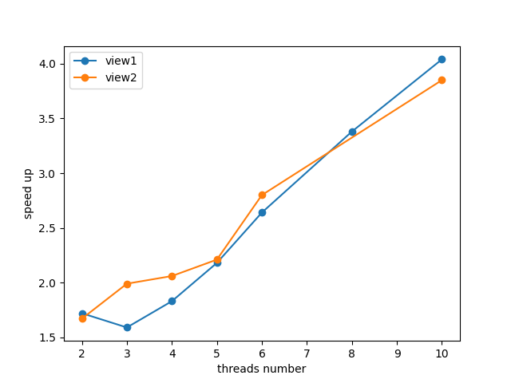

> 实验环境:
> 物理核：6
> 逻辑核：12
> 是否支持超线程：支持

## 1.1 && 1.2

View1

| 线程数量 | 加速比 |
|-----|-----|
| 2 | 1.72x |
| 3 | 1.59x |
| 4 | 1.83x |
| 5 | 2.18x |
| 6 | 2.64x |
| 7 | 需要尾数处理 |
| 8 | 3.38x |
| 10 | 4.04x |
| 12 | 4.38x |
| 24 | 5.47x |
| 48 | 6.22x |
| 80 | 7.28x |
| 100 | 7.72x |  
| 120 | 7.54x |
| 150 | 7.30x |

在线程数量为3时，相比线程数量为2，反而加速比下降了。

View2 

| 线程数量 | 加速比 |
|-----|-----|
| 2 | 1.67x |
| 3 | 1.99x |
| 4 | 2.06x |
| 5 | 2.21x |
| 6 | 2.80x |
| 7 | 需要尾数处理 |
| 8 | 需要尾数处理 |
| 10 | 3.85x |

无论是View1还是View2都不是线性的  

## 1.3

View1 8线程

Thread 0 time: 16.645 ms
Thread 7 time: 17.619 ms
Thread 1 time: 77.781 ms
Thread 6 time: 80.376 ms
Thread 2 time: 156.778 ms
Thread 5 time: 156.672 ms
Thread 3 time: 228.058 ms
Thread 4 time: 230.719 ms

View2 10线程

Thread 9 time: 35.718 ms
Thread 7 time: 41.686 ms
Thread 3 time: 42.862 ms
Thread 4 time: 45.874 ms
Thread 6 time: 47.390 ms
Thread 2 time: 48.687 ms
Thread 5 time: 48.458 ms
Thread 8 time: 51.932 ms
Thread 1 time: 66.060 ms
Thread 0 time: 97.200 ms

可以发现无论是View1还是View2的线程负载都不是均衡的，这就印证了他们的加速比不是线性的。

+ 在View1中为什么线程数量为3，加速比反而下降了？
  + 线程数量为2时：
    Thread 0 time: 294.659 ms
    Thread 1 time: 295.883 ms
  + 线程数量为3时：
    Thread 2 time: 119.529 ms
    Thread 0 time: 120.127 ms
    Thread 1 time: 362.691 ms
  + 这是因为View1的计算负载主要集中在图形中的中间部分，如果是三个线程，那么这部分负载恰好分给一个单独的线程，这个线程就会成为瓶颈。两个线程的话，该部分计算负载会被平均分为两个部分，所以加速比会上升。

## 1.4

